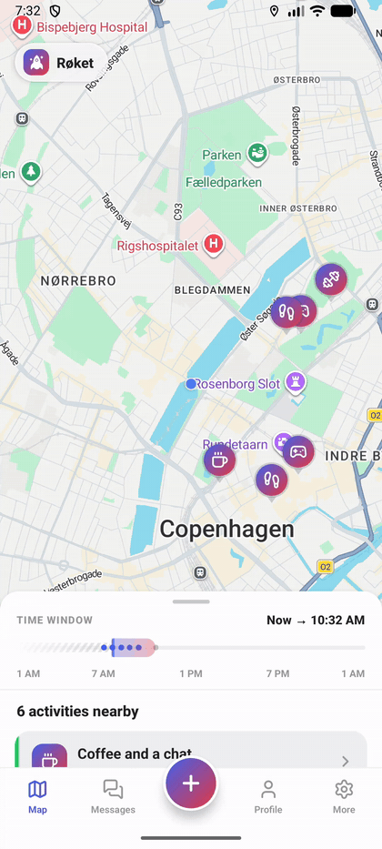
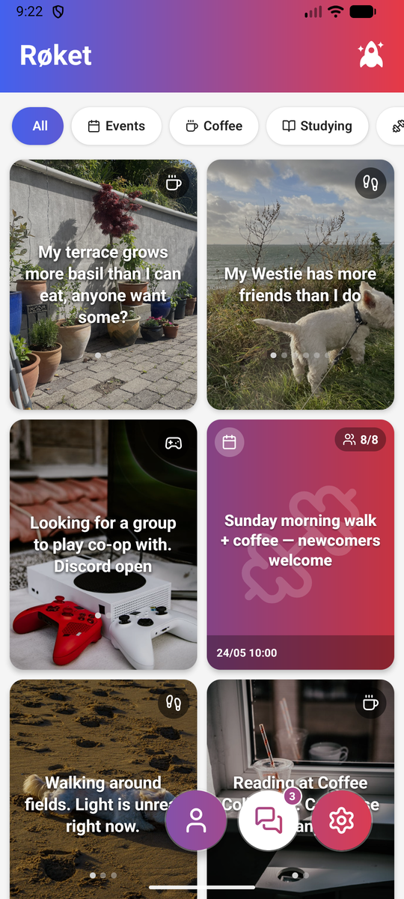
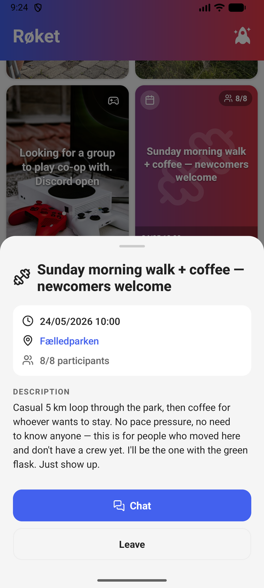
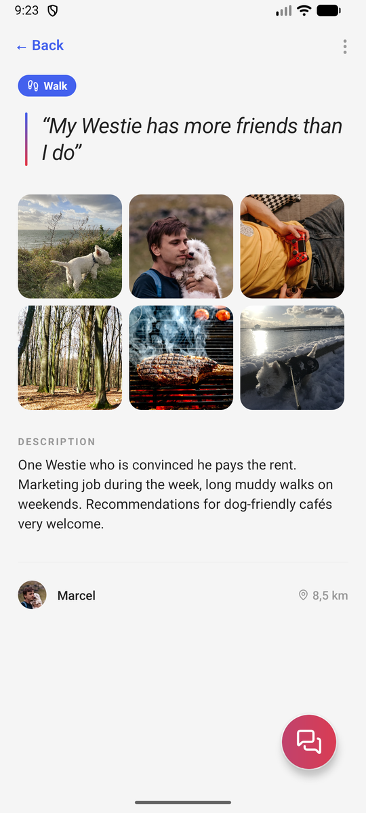
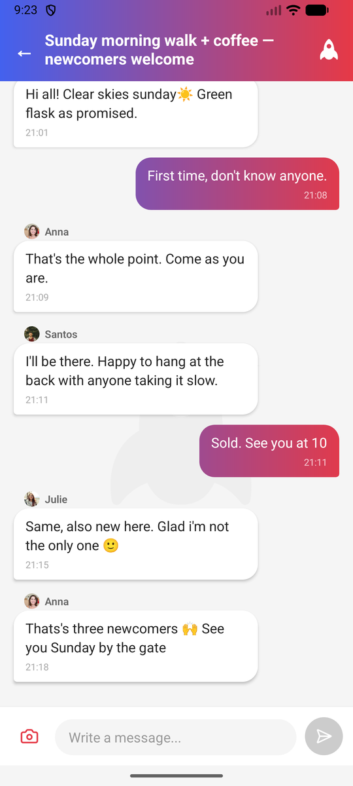

# Røket

An anti-loneliness app for doing things with people nearby. See what's happening around you on a live activity map, post or join open invitations, and turn a quiet moment into something real — coffee, a walk, a group hangout. Built with React Native (iOS/Android) and Firebase.

## Links

- Landing page: [roketapp.eu](https://roketapp.eu/)
- Android: [Google Play](https://play.google.com/store/apps/details?id=com.roket)
- iOS: v2.0 App Store submission in preparation

## Features

- **Activity map** — The front page is a map of what people nearby are doing right now: every activity is a marker you can tap, with a swipeable drawer listing the same activities as rich cards sorted by distance.
- **Time scrubber** — Drag a 3-hour window along a rolling 24-hour axis to see what's happening later tonight or tomorrow morning. The scrub animation runs on the UI thread (Reanimated) at 60 fps; map pins and the list re-filter on release.
- **Events / open invitations** — Post an activity you want to do (coffee, run, study, drinks) and let people nearby join. Every event gets its own group chat, and expired events clean themselves up server-side.
- **Keep in touch** — After doing an activity together, either participant can request to stay connected, opening a private 1-on-1 chat. Breaking a connection has an undo path: the other person gets one chance to re-request before the break becomes a block — a small state machine enforced across client, security rules, and Cloud Functions.
- **Group & 1-on-1 chat** — Talk around an event with the participants, or message your connections. Unread counters, push notifications, and photos that auto-expire after 12 hours and are scanned for safety on upload.
- **Guest mode** — Browse all four tabs without an account: live map, example profile, and empty states that explain the concept. Anonymous accounts are swept automatically after 30 days by a scheduled job.
- **Status-based profiles** — A short status + optional activity tag (15 tags: coffee, workout, hike, …) plus the activities you're part of. The whole UX is designed around doing things together, not browsing people.
- **Multi-language** — Danish, English, Spanish, German, French, Portuguese, sharing one source of truth.
- **Dark/light mode** — Automatic from system, or manually overridden. The map restyles with the theme.

## Tech Stack

| Layer | Technology |
|-------|-----------|
| **Mobile** | React Native (New Architecture / Fabric), TypeScript |
| **Maps** | react-native-maps with custom themed markers |
| **Backend** | Firebase (Auth, Firestore, Storage, Cloud Functions, Cloud Messaging) |
| **Image moderation** | Google Cloud Vision API (SafeSearch) on upload |
| **Geo** | Lat/lng with client-side Haversine distance; geohash on the roadmap for scale |

## Architecture

```
src/                  # React Native mobile app
├── features/         # Feature-based folders (map, events, chat, profile, …)
├── components/       # Shared UI components
├── navigation/       # Bottom-tab navigator with custom tab bar
├── services/         # LocationService, NotificationService
├── utils/            # Pure helpers (eventTime, userInfo, …)
└── translations.ts   # i18n for 6 languages

functions/            # Firebase Cloud Functions
                      # Push notifications, image safety, connection lifecycle,
                      # account deletion, scheduled cleanup jobs

__tests__/            # Jest unit tests (pure-logic coverage, growing)
```

## Key Technical Decisions

- **Event-driven backend on Cloud Functions** — Firestore/Storage triggers, scheduled jobs, and callable admin endpoints handle push notifications, expiring-image cleanup, and admin tasks — keeping privileged logic off the client.
- **Connection lifecycle as a rules-enforced state machine** — Breaking, re-requesting, and blocking a connection are modelled as one-way field transitions that Firestore security rules let each client set exactly once, with Cloud Functions triggers performing the privileged cleanup.
- **Custom map markers on Fabric** — Activity markers are themed React views; working around the New Architecture's marker rasterization (view snapshotting, no absolutely-positioned children) required a dedicated warm-up wrapper.
- **Automated + human content moderation** — Uploaded images are scanned by Google Cloud Vision SafeSearch via a Storage trigger, with NSFW content auto-removed and logged to an audit trail — backing a human layer of reports, warnings, and bans.
- **Native permission handling** — Cross-platform location permissions and a location watch tied to AppState, so the app stays stable when permissions change in the background.
- **Resilient real-time data layer** — `onSnapshot` listeners drive the UI, with bans enforced only on server-confirmed data, atomic `FieldValue` updates, and clean listener teardown on logout.
- **Type-safe internationalization** — UI copy lives in one `translations.ts` with the type derived from a single locale, so a missing key in any of 6 languages fails at compile time.

## Screenshots

Screenshots are being refreshed for the 2.0 map-first redesign — coming with the store release.

<!-- TODO(2.0): replace with new map/drawer/profile/chat screenshots + demo.gif after the 7d screenshot session
<p align="center">
  &nbsp;
  &nbsp;
  &nbsp;
  &nbsp;
  
</p>
-->

## Setup

### Prerequisites
- Node.js 20+
- React Native development environment ([setup guide](https://reactnative.dev/docs/set-up-your-environment))
- A Firebase project with Firestore, Auth, Storage, and Cloud Functions enabled

### Mobile
```bash
npm install
npx react-native run-android  # or run-ios
```

### Tests
```bash
npm test
```

### Cloud Functions
```bash
cd functions && npm install
firebase deploy --only functions
```
